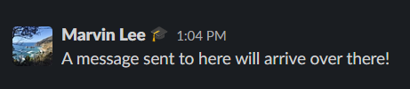
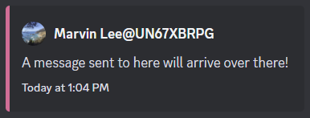
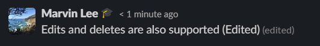
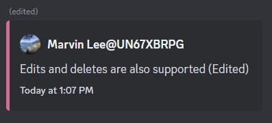
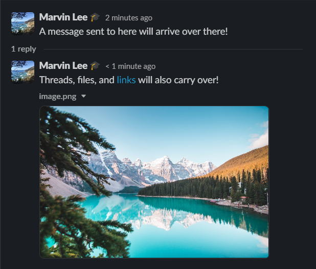
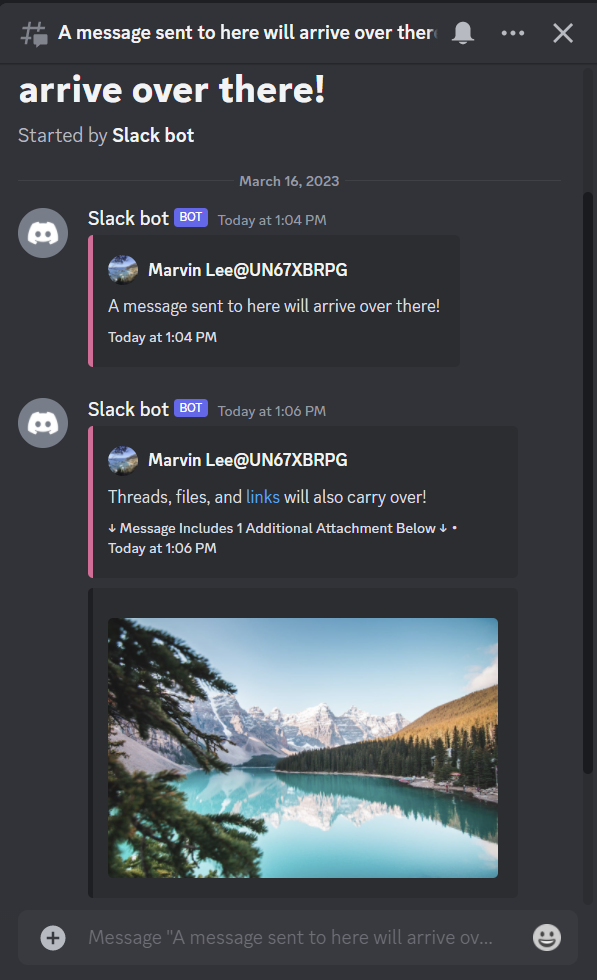

Slack to Discord Bridge
=======================

# Purpose

This repository contains the source code for a Slack App that listens to a Slack Workspace public channels and forwards all of its messages and files to a Discord server as a back-up or archive.

## Features
The following images show off common usages and subset of what the bot is capable of!

### Basic Message Support

### Message Edits and Deletions

### Thread Support

# Basic Set-Up

To start setting this project up, clone this repository and run `npm install` to install the dependencies required to run. 
Next, follow the steps to [Create a New Slack App](#how-to-create-a-new-slack-app) and [Create a New Discord Bot](#discord-bot-set-up) below. 
Run `npm run setup` and enter the credentials from the Slack App and Discord Bot as well as some preferences. That way, the script can automatically configure and test its features. 
Once set-up is complete, run `node .` and the bot will be live!

# How to Create a New Slack App

Go to the [Slack Developers page](https://api.slack.com/apps), log into the workspace you want to install your app, and click on `Create New App > From scratch`. 
Give the app a name and select a workspace to run the app on. 
On the `Basic Information` page, go to `Add features and functionality > Event Subscriptions` 
`Enable Events` and verify the `Request URL` (the URL or IP address of the device this program runs on) with the `node_modules/.bin/slack-verify` script from Slack. [How To](https://github.com/slackapi/node-slack-sdk#listening-for-an-event-with-the-events-api) 
In the `Subscribe to bot events` section, subscribe the bot to the following events: `message.channel` and `file_shared` 
In `Basic Information > Add features and functionality > Permissions > Scopes`, add `channels:read` for the `User Token Scopes` section. 
For the `Bot Token Scopes` section (same page), add the scopes listed below in [Bot Scope List and Usages](#bot-scope-list-and-usages) 
Scroll to the top or go back to `Basic Information > Install your app` and add your bot to your workspace! 
You should now go to `Basic Information > Add features and functionality > Permissions` and see your OAuth tokens at the very top. You will need this to continue setting up the program later.

## A Note About Verifying Your Slack App URL

To link up the Request URL to the Slack App, you will need to follow Slack's instructions. 
To obtain a public URL or IP address, you will need to open up a port to the internet through `port-forwarding` or a service like `ngrok`. 
Then run the script in `node_modules/.bin/slack-verify` with `./node_modules/.bin/slack-verify -s <SLACK_SIGNING_SECRET>` and type the URL at the `/slack/events` endpoint in `Add features and functionality > Event Subscriptions > Enable Events > Request URL` 
`(Warning, if your URL changes you will have to do this step again. Ngrok Free Plan changes the url each time ngrok is restarted so keep it running in another terminal or the background at all times)` 

# Discord Bot Set-Up

Go to the [Discord Developers Portal](https://discord.com/developers/applications) and create a new bot 
Find the `Client ID` in the `General Information` page and replace the braces in this url with it to invite it to the Discord Server you want to use with Admin permissions(Required): https://discord.com/oauth2/authorize?client_id={Client_ID_Goes_Here}&scope=bot&permissions=8  
Next, go to the `Bot` page and reveal the `TOKEN` for the bot.  
Optional: Customize the bot by giving it a name, profile picture, and description on the `General Information` page 

# Set-Up Complete! Now let's run it

At last, run `node .` and the Discord Bot and Slack App will both boot up. 
Send a message to a Slack channel that the Slack App is in and watch the message appear on Discord as well!

# Documentation

Documentation for this project's source code can be generated by running `npm run jsdoc` and viewed by running `npm run jsdoc-serve`. You can then read it at the URL displayed in the console.

# Bot Scope List and Usages

* Obtaining A List Of Channels To Join:`channels:read`
* Joining Channels From A List: `channels:join`
* Receiving Messages From Slack: `channels:history`
* Receiving And Copying Files From Slack: `files:read`
* Looking Up The Sender Of Each Message: `users:read`
* Listening To Pins And Unpins: `pins:read`

## Future Features
The bot currently only supports one-way communication (From Slack to Discord) and not the other way around. 
Although, the code is designed to provide a framework for sending messages back, this has not been implemented.

Another future feature to provide is a better set up guide and self-check since the current process hasn't been perfected yet and only works...